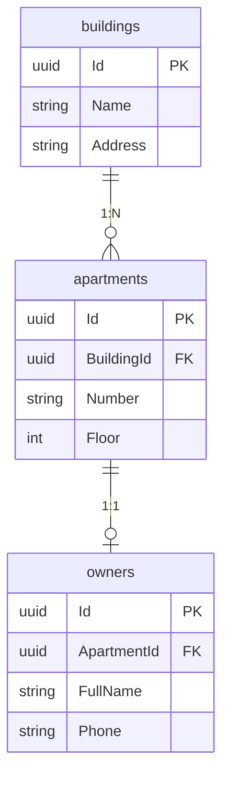

# Собеседование: full stack разработчик — вопросы по коду

**Проект:** Зелёный квартал — Учёт электроэнергии  
**Роль:** full stack разработчик (C# / ASP.NET Core / Vue / PostgreSQL)  
**Формат:** онлайн, устное обсуждение примеров кода  
**Время:** 60 минут (≈ 4 мин на вопрос)

---

## История


**Василий** — энергетик жилого комплекса **«Зелёный квартал»**. Он отвечает за учёт потребления электроэнергии: жильцы передают показания счётчиков, Василий сверяет данные и готовит сводки по домам.

Справочник домов и квартир в системе уже работает. Передачу показаний заказали **фрилансеру** — нужно было сделать API, сохранение в PostgreSQL и форму на Vue. Работу сдали «на скорую руку»: в коде оказались типичные ошибки — путаница с async/await, проблемы с EF Core, слабая валидация, баги на frontend.

Фрилансер после оплаты **перестал выходить на связь**. Василий несколько недель тушил пожары с жильцами и бухгалтерией, потом **отказался от дальнейшей работы с подрядчиком** и обратился в IT-отдел: нужен **штатный full stack разработчик**, который разберётся в коде, доведёт функциональность до ума и будет сопровождать систему дальше.

Сегодняшняя сессия — часть отбора. Интервьюер покажет **фрагменты кода** (в том числе похожие на то, что оставил фрилансер). Ваша задача — **объяснить вслух**, что делает код, где ошибки или риски, как исправить или спроектировать лучше. Примеры связаны с доменом Василия: показания счётчиков, API, Vue-форма, SQL-сводки по дому.

<div style="clear: both;"></div>

> «Мне нужен человек, который не просто „закроет задачу“, а **понимает**, почему в production что-то падает или теряются данные. Покажите, что вы такой человек».

---

## Как проходит сессия

| Время | Этап |
|-------|------|
| 0–5 мин | Вводная, знакомство |
| 5–55 мин | 15 вопросов по примерам кода (устно, можно уточнять) |
| 55–60 мин | Ваши вопросы |

Оценивается **понимание** и ход мысли, а не дословное совпадение с «правильным» ответом.

**Подсказка:** в примерах на C# считайте, что `using`, nullable reference types и лишний boilerplate опущены, если не указано иное.

---

## Вопросы

### Q1. C# — ссылочные типы (передача по ссылке)

**Что выведет программа и почему?**

```csharp
var a = new A { Value = 5 };
Helper.Test(a);
Console.WriteLine(a.Value);

public class A
{
    public int Value { get; set; }
}

public static class Helper
{
    public static void Test(A a)
    {
        a.Value = 10;
        a = new A { Value = 15 };
    }
}
```

---

### Q2. C# — value types (struct)

**Что выведет программа? Чем результат отличается от Q1?**

```csharp
var p = new Point { X = 1, Y = 2 };
Move(p);
Console.WriteLine($"{p.X}, {p.Y}");

public struct Point
{
    public int X { get; set; }
    public int Y { get; set; }
}

public static void Move(Point p)
{
    p.X = 10;
    p.Y = 20;
}
```

---

### Q3. C# — async/await

**В каком порядке появятся строки в консоли?**

```csharp
Console.WriteLine("A");
await PrintAsync();
Console.WriteLine("D");

static async Task PrintAsync()
{
    Console.WriteLine("B");
    await Task.Delay(100);
    Console.WriteLine("C");
}
```

---

### Q4. C# — record и копирование

**Сколько показаний будет в списке после выполнения? Что выведет `First().Value`?**

```csharp
var original = new ReadingDto(ApartmentId: Guid.NewGuid(), Value: 100m);
var copy = original with { Value = 200m };

var list = new List<ReadingDto> { original };
list.Add(copy);

Console.WriteLine(list.Count);
Console.WriteLine(list.First().Value);

public sealed record ReadingDto(Guid ApartmentId, decimal Value);
```

---

### Q5. ООП — инкапсуляция

**Какие проблемы вы видите в этом фрагменте доменной модели? Как исправить, не ломая инварианты?**

```csharp
public class MeterReading
{
    public Guid Id { get; set; }
    public decimal Value { get; set; }
    public int PeriodMonth { get; set; }
}

// Где-то в handler:
reading.Value = -50;
reading.PeriodMonth = 13;
await repository.SaveAsync(reading);
```

---

### Q6. ООП — Liskov и контракт

**Почему этот код может нарушать принцип подстановки Лисков? Как бы вы спроектировали иначе?**

```csharp
public abstract class Notifier
{
    public abstract void Send(string message);
}

public class EmailNotifier : Notifier
{
    public override void Send(string message) => /* отправка email */;
}

public class SilentNotifier : Notifier
{
    public override void Send(string message)
    {
        throw new NotSupportedException("Silent notifier cannot send.");
    }
}

void NotifyAll(IEnumerable<Notifier> notifiers, string text)
{
    foreach (Notifier n in notifiers)
        n.Send(text);
}
```

---

### Q7. ASP.NET Core — DI и время жизни

**Что пойдёт не так при такой регистрации? Какой lifetime у сервисов и почему это опасно?**

```csharp
// Program.cs
builder.Services.AddSingleton<ReadingCache>();
builder.Services.AddScoped<IReadingRepository, ReadingRepository>();

public sealed class ReadingCache
{
    private readonly IReadingRepository _repository;

    public ReadingCache(IReadingRepository repository)
    {
        _repository = repository;
    }
}
```

---

### Q8. ASP.NET Core — коды ответа API

**Клиент отправил `POST /api/v1/apartments/{id}/meter-readings` с несуществующим `id` и телом `{ "periodMonth": 13, "periodYear": 2026, "value": 100 }`.**

Handler устроен так:

```csharp
await validator.ValidateAndThrowAsync(command, cancellationToken);
var apartment = await apartmentRepository.GetByIdAsync(command.ApartmentId, ct)
    ?? throw new NotFoundException();
// ...
```

**Какой HTTP-статус получит клиент — 400 или 404? Можно ли сделать иначе? Обоснуйте.**

---

### Q9. ASP.NET Core — async в контроллере

**В чём проблема этого action? Что может произойти в production?**

```csharp
[HttpPost("{apartmentId:guid}/meter-readings")]
public IActionResult Submit(Guid apartmentId, SubmitRequest request)
{
    _ = Task.Run(async () =>
    {
        await _repository.AddAsync(Map(request));
    });

    return Accepted();
}
```

---

### Q10. Vue 3 — reactivity (ref)

**Что выведет `console.log` после клика по кнопке? Почему?**

```vue
<script setup lang="ts">
import { ref } from 'vue';

const count = ref(0);

function incrementWrong() {
  let local = count.value;
  local++;
}

function incrementRight() {
  count.value++;
}
</script>

<template>
  <p>{{ count }}</p>
  <button @click="incrementWrong">+ wrong</button>
  <button @click="incrementRight">+ right</button>
</template>
```

---

### Q11. Vue 3 — props и однонаправленный поток

**Что произойдёт при вводе текста в поле? Как правильно организовать обновление?**

```vue
<!-- Parent.vue -->
<script setup lang="ts">
import { ref } from 'vue';
import Child from './Child.vue';

const title = ref('Кв. 12');
</script>

<template>
  <Child :title="title" />
</template>

<!-- Child.vue -->
<script setup lang="ts">
const props = defineProps<{ title: string }>();
</script>

<template>
  <input v-model="props.title" />
</template>
```

---

### Q12. EF Core — tracking

**Почему после `SaveChanges` в базе может остаться старое значение `Value`?**

```csharp
var reading = await dbContext.MeterReadings
    .AsNoTracking()
    .FirstAsync(x => x.Id == id);

reading.UpdateValue(1500m);

dbContext.MeterReadings.Update(reading);
await dbContext.SaveChangesAsync();
```

*(Метод `UpdateValue` меняет `Value` и `SubmittedAt` in-place.)*

---

### Q13. SQL — сводка для Василия

**Контекст:** есть таблицы `buildings`, `apartments`, `owners`, `meter_readings`.

#### ERD (справочники)



| Таблица | Ключевые колонки |
|---------|------------------|
| `buildings` | `Id`, `Name`, `Address` |
| `apartments` | `Id`, `BuildingId`, `Number` |
| `owners` | `ApartmentId` (UNIQUE), `FullName` |

**Задача:** напишите SQL (PostgreSQL), который по `:building_id`, `:year`, `:month` вернёт:

- номер квартиры;
- ФИО владельца;
- переданное показание **или** `NULL`, если не сдано.

Сортировка по номеру квартиры.

---

### Q14. SQL — аномалии

**Задача:** напишите SQL, который находит квартиры, где показание за текущий месяц **меньше**, чем показание за предыдущий календарный месяц (аномалия для проверки Василием).

Допущение: по одной записи на квартиру за каждый `(PeriodYear, PeriodMonth)`.

---

### Q15. ERD — проектирование

**Контекст:** в системе уже есть `buildings` → `apartments` → `owners` (1:1).

Василий просит хранить **показания электросчётчика** по квартире:

- привязка к **календарному месяцу**;
- одно показание на квартиру за месяц (повторная передача — обновление);
- дата/время последней передачи;
- показание не может быть отрицательным;
- нужна история для таблицы на frontend.

**Задача:**

1. Спроектируйте таблицу (или таблицы) — перечислите колонки, типы, PK/FK, UNIQUE.
2. Объясните связь с `apartments`.
3. Как обеспечить правило «не больше одного показания за период на квартиру»?

---

*Вопросы для онлайн-собеседования full stack разработчика. Версия: 2026-06-26.*
