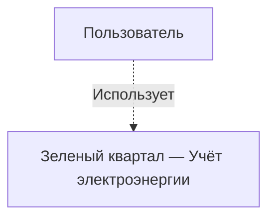
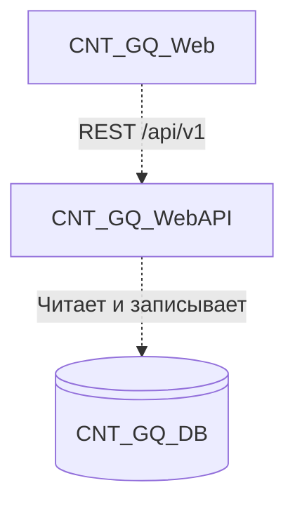
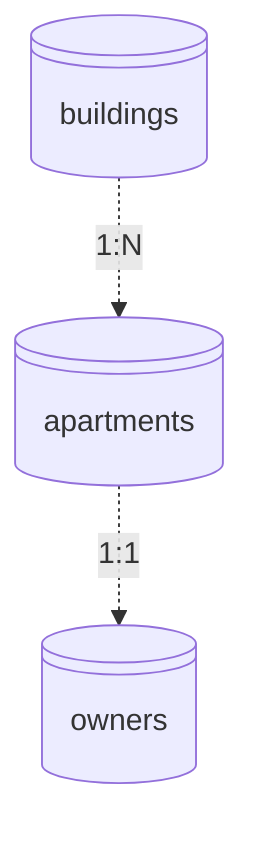

# Задание на собеседование: системный аналитик

**Проект:** Зелёный квартал — Учёт электроэнергии  
**Роль:** системный аналитик  
**Формат:** онлайн (видеоконференция, демонстрация экрана на защите)  
**Время:** не более **1 часа**

**Что подготовить:** ноутбук, стабильный интернет, инструмент для работы (Miro, draw.io — на ваш выбор), возможность показать экран в конце сессии.

---

## Как проходит сессия

| Время | Этап | Ваши действия |
|-------|------|---------------|
| 0–5 мин | Вводная | Знакомство, краткий контекст от интервьюера |
| 5–10 мин | Погружение | Изучите разделы **«Архитектура»** и **«ERD»** ниже; задайте до 3 уточняющих вопросов |
| 10–50 мин | Работа | Оформите артефакты по разделу **«Что нужно сдать»** |
| 50–60 мин | Защита | Покажите экран с результатом и обсудите решение |

Оценивается ход мысли и согласованность артефактов в условиях ограниченного времени, а не «идеальность» документа.

---

## История


Василий — энергетик жилого комплекса **«Зелёный квартал»**. Он отвечает за учёт потребления электроэнергии: собирает показания счётчиков, сверяет их с нормативами и передаёт данные в бухгалтерию.

В системе уже ведётся **справочник объектов**: дома, квартиры и владельцы. Василий обращается к вам с новой задачей:

> «Справочник есть — отлично. Но каждый месяц я обхожу квартиры или принимаю звонки: жильцы диктуют цифры с электросчётчика, я записываю в Excel, потом переношу вручную. Ошибки, дубли, споры „я же уже передавал“. Мне нужно, чтобы **владелец квартиры сам передавал показания через систему**, а я видел историю и мог проверить аномалии. Сделайте нормально, пожалуйста».

Разработчики просят **формализованные требования** перед началом разработки.

---

## Ваша задача

За **45 минут** спроектировать **MVP** функциональности **«Передача показаний электроэнергии»** в рамках существующей системы.

Интервьюер на сессии играет роли **Василия (заказчик)** и **тимлида**. Уточняющие вопросы задавайте устно; если ответа нет — фиксируйте **допущение** и продолжайте работу.

### Ожидания от Василия (MVP)

1. Жилец передаёт **текущее показание** счётчика по своей квартире.
2. Показание привязано к **календарному месяцу**.
3. Энергетик видит, кто уже сдал показания по дому.
4. Показание **не может быть меньше** предыдущего.

**Вне scope:** расчёт оплаты, бухгалтерия, фото счётчика, SMS-напоминания.

---

## Что уже реализовано в системе

| Функция | Статус |
|---------|--------|
| Список домов, создание и изменение домов | ✅ |
| Квартиры дома с данными владельца | ✅ |
| Создание квартир, назначение владельца | ✅ |
| Веб-страница «Справочники» | ✅ |
| Передача показаний счётчиков | ❌ |
| Учётные записи жильцов / вход владельца | ❌ |

Примеры уже существующих REST-эндпоинтов (ориентир по стилю API):

| Метод | Путь | Назначение |
|-------|------|------------|
| GET | `/api/v1/buildings` | Список домов |
| GET | `/api/v1/buildings/{buildingId}/apartments` | Квартиры дома с владельцами |
| PUT | `/api/v1/apartments/{apartmentId}/owner` | Назначение владельца квартиры |

---

## Архитектура системы (C4)

### Контекст (уровень 1)



| Элемент | Описание |
|---------|----------|
| **Пользователь** | Сейчас — энергетик Василий; в MVP также владелец квартиры (жилец). |
| **Система** | Внутренняя ИС ЖК. Внешних интеграций на первом этапе нет. |

### Контейнеры (уровень 2)



| Контейнер | Технология | Назначение |
|-----------|------------|------------|
| **CNT_GQ_Web** | React, TypeScript | Веб-интерфейс (SPA) |
| **CNT_GQ_WebAPI** | ASP.NET Core, .NET 8 | REST API, бизнес-логика |
| **CNT_GQ_DB** | PostgreSQL | Данные; идентификаторы — **UUID** |

**Поток:** `CNT_GQ_Web` → `CNT_GQ_WebAPI` → `CNT_GQ_DB`.  
Новые контейнеры или внешние системы для MVP **не предполагаются** (если не обоснуете иначе).

---

## Текущая схема данных (ERD справочников)



### Поля таблиц

**`buildings`**

| Колонка | Тип | Ограничения | Описание |
|---------|-----|-------------|----------|
| `Id` | `uuid` | PK | Идентификатор |
| `Name` | `varchar(256)` | NOT NULL | Наименование дома |
| `Address` | `varchar(512)` | NULL | Адрес |

**`apartments`**

| Колонка | Тип | Ограничения | Описание |
|---------|-----|-------------|----------|
| `Id` | `uuid` | PK | Идентификатор |
| `BuildingId` | `uuid` | FK → `buildings` | Дом |
| `Number` | `varchar(32)` | NOT NULL | Номер квартиры |
| `Floor` | `int` | NULL | Этаж |

Уникальный индекс: (`BuildingId`, `Number`).

**`owners`**

| Колонка | Тип | Ограничения | Описание |
|---------|-----|-------------|----------|
| `Id` | `uuid` | PK | Идентификатор |
| `ApartmentId` | `uuid` | FK → `apartments`, UNIQUE | Квартира |
| `FullName` | `varchar(256)` | NOT NULL | ФИО владельца |
| `Phone` | `varchar(32)` | NULL | Телефон |

Связь владельца с квартирой — **1:1**. В системе есть демо-данные: 10 домов × 50 квартир.

---

## Формат описания требований (образец)

Оформляйте требования **простым текстом** или в виде use case. Пример:

**FR-01. Передача показания владельцем**  
Владелец квартиры вводит текущее показание электросчётчика и отчётный месяц. Система сохраняет показание и привязывает его к квартире.

**UC-01. Передача показания (основной сценарий)**

| | |
|---|---|
| **Актор** | Владелец квартиры |
| **Предусловие** | Квартира есть в справочнике, владелец назначен |
| **Шаги** | 1. Владелец открывает форму передачи показаний<br>2. Указывает месяц и значение счётчика<br>3. Подтверждает отправку |
| **Результат** | Показание сохранено, владелец видит подтверждение |

**UC-01a. Показание меньше предыдущего (ошибка)**

| | |
|---|---|
| **Условие** | Новое значение меньше последнего сохранённого показания по квартире |
| **Результат** | Система отклоняет ввод и показывает сообщение об ошибке |

---

## Что нужно сдать (45 минут)

Достаточно черновика в Google Docs, Notion, Miro или draw.io — полный документ не требуется.

### 1. User stories — 3 штуки

| ID | Как | Я хочу | Чтобы |
|----|-----|--------|-------|
| US-… | роль | … | … |

Обязательны роли **владелец квартиры** и **энергетик**.

### 2. Требования — 2 функции

Для каждой функции укажите краткое описание (как **FR-…**) и **один use case** (основной сценарий).  
Обязательно покройте:

- **передачу показания** (успешный сценарий);
- **одну ошибку** на выбор: показание меньше предыдущего / повтор за тот же месяц / квартира не найдена.

### 3. ERD — минимум 1 новая таблица

Покажите, как хранятся показания и как они связаны с `apartments`.  
Достаточно таблицы полей или схемы на Miro/draw.io (5–8 полей).

### 4. REST API — 2 эндпоинта

| Метод | Путь | Назначение | Коды ответов |
|-------|------|------------|--------------|

Префикс `/api/v1`, стиль как у существующих путей выше.

### 5. SQL — 1–2 запроса (PostgreSQL)

Напишите запросы к **вашей** схеме данных (существующие таблицы + новая таблица показаний).  
Имена таблиц и колонок — как в вашем ERD.

**Обязательный запрос для Василия:**  
по выбранному дому и отчётному месяцу вывести список квартир с полями: номер квартиры, ФИО владельца, переданное показание (или признак «не сдано»).

**На выбор (второй запрос):**  
вставка нового показания **или** выборка квартир, где показание за месяц меньше предыдущего периода (аномалия).

Пример оформления (структура вашей таблицы может отличаться):

```sql
-- Статус сдачи показаний по дому за месяц (имена полей — по вашему ERD)
SELECT
    a."Number"       AS apartment_number,
    o."FullName"     AS owner_name,
    mr."Value"       AS reading_value   -- NULL, если не сдано
FROM apartments a
INNER JOIN owners o ON o."ApartmentId" = a."Id"
LEFT JOIN meter_readings mr
    ON mr."ApartmentId" = a."Id"
   AND mr."PeriodYear" = :year
   AND mr."PeriodMonth" = :month
WHERE a."BuildingId" = :building_id
ORDER BY a."Number";
```

> В проекте колонки в БД — в **PascalCase** (`Id`, `BuildingId`). В запросе можно использовать кавычки для имён: `"Id"`, `"BuildingId"`.

### Не нужно в рамках часа

- полный OpenAPI YAML;
- диаграмма последовательности;
- детальная проработка авторизации жильца (достаточно допущения).

---

## Защита (15 минут)

Будьте готовы показать экран и обсудить:

- почему выбрана такая модель данных;
- как ваш SQL-запрос решает задачу Василия (сдано / не сдано);
- что происходит при повторной передаче за тот же месяц;
- как жилец привязывается к квартире без готового входа в систему;
- какой эндпоинт или функцию вы бы добавили следующим шагом после MVP.


---

*Задание для онлайн-собеседования системного аналитика. Версия: 2026-06-26.*
