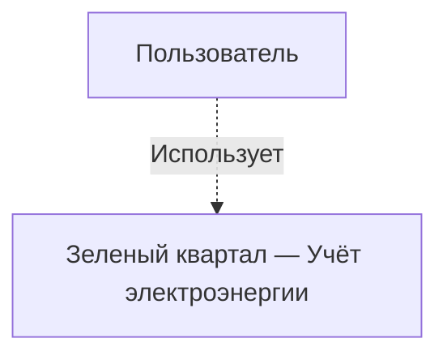
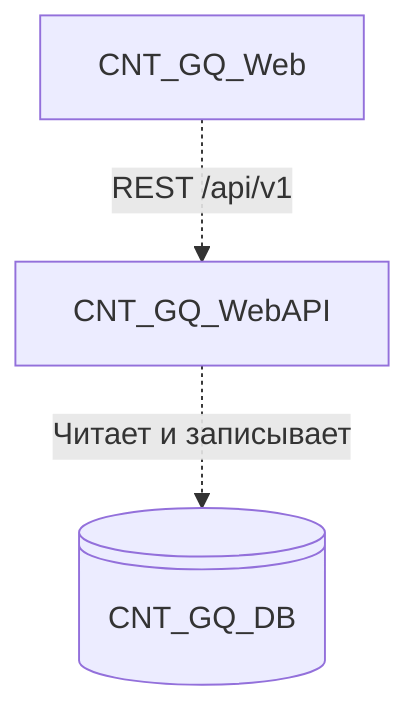
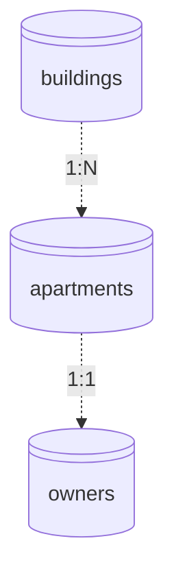

# Задание на собеседование: системный аналитик

**Проект:** Зелёный квартал — Учёт электроэнергии  
**Роль:** системный аналитик  
**Формат:** очно, на площадке интервьюера  
**Общее время:** **не более 1 часа** (без домашней подготовки)  
**Инструменты:** бумага / маркерная доска / ноутбук кандидата (Word, Notion, draw.io — на выбор)

---

## История

Василий — энергетик жилого комплекса **«Зелёный квартал»**. Он отвечает за учёт потребления электроэнергии: собирает показания счётчиков, сверяет их с нормативами и передаёт данные в бухгалтерию.

Несколько месяцев назад команда разработки запустила внутреннюю систему учёта. Василий уже ведёт в ней **справочник объектов**: дома, квартиры и владельцы. Теперь он приходит к вам с новой болью:

> «Справочник есть — отлично. Но каждый месяц я обхожу квартиры или принимаю звонки: жильцы диктуют цифры с электросчётчика, я записываю в Excel, потом переношу вручную. Ошибки, дубли, споры „я же уже передавал“. Мне нужно, чтобы **владелец квартиры сам передавал показания через систему**, а я видел историю и мог проверить аномалии. Сделайте нормально, пожалуйста».

У команды разработки нет свободного аналитика: Василий описал задачу устно, а разработчики просят **формализованные требования** в принятом в проекте формате, прежде чем писать код.

**Ваша роль на собеседовании:** за 45 минут работы набросать минимальный пакет артефактов для capability **«Передача показаний электроэнергии»**, затем 15 минут — обсудить решение с интервьюером (интервьюер играет роль Василия и тимлида).

---

## Расписание сессии (60 мин)

| Время | Этап | Что происходит |
|-------|------|----------------|
| 0–5 мин | Вводная | Интервьюер кратко представляет контекст; кандидат получает этот лист (или открывает на экране) |
| 5–10 мин | Погружение | Кандидат изучает **диаграммы C4 и ERD ниже** в этом документе; задаёт 2–3 быстрых вопроса |
| 10–50 мин | Работа | Кандидат оформляет артефакты (см. ниже) |
| 50–60 мин | Защита | Устное обсуждение: вопросы интервьюера, уточнения, оценка |

> Домашней подготовки **нет**. Оценивается ход мысли и качество артефактов в условиях ограниченного времени, а не полировка документа.

---

## Что уже есть в системе

Реализована capability `directories` (справочники ЖК):

| Функция | Статус |
|---------|--------|
| Список домов, CRUD домов | ✅ |
| Квартиры дома с данными владельца | ✅ |
| Создание квартир, назначение владельца | ✅ |
| SPA: страница «Справочники» | ✅ |
| Передача показаний счётчиков | ❌ не реализовано |
| Учётные записи жильцов / аутентификация владельца | ❌ не реализовано |

Эталон формата требований в проекте: `openspec/specs/directories/spec.md` (приложить кандидату распечатку 2–3 ключевых requirement или открыть на втором мониторе).

---

## Архитектура системы (C4)

Диаграммы сгенерированы из модели LikeC4 (`docs/architecture/diagram/`). При изменении архитектуры: `npm run likec4:gen`.

### Контекст (C4 Level 1)

*View: `context` — «Контекст — Зелёный квартал, учёт электроэнергии»*



| Элемент | Описание |
|---------|----------|
| **Пользователь** | Энергетик Василий; в перспективе — владелец квартиры (жилец). |
| **Система** | Внутренняя ИС ЖК. Внешних интеграций на MVP нет. |

### Контейнеры (C4 Level 2)

*View: `containers` — «Контейнеры — Зелёный квартал, учёт электроэнергии»*



| Контейнер | Технология | Назначение |
|-----------|------------|------------|
| **CNT_GQ_Web** | React, TypeScript, Vite, Ant Design | SPA: UI, вызовы REST API |
| **CNT_GQ_WebAPI** | ASP.NET Core, .NET 8, MediatR, EF Core | REST API `/api/v1`, бизнес-логика |
| **CNT_GQ_DB** | PostgreSQL | Транзакционные данные; идентификаторы — **UUID** |

**Поток:** `CNT_GQ_Web` → `CNT_GQ_WebAPI` → `CNT_GQ_DB`. Новые контейнеры на MVP не нужны.

---

## Текущая ERD (справочники)

*View: `db_directories` — «CNT_GQ_DB — ERD справочников»*



### Поля таблиц

**`buildings`**

| Колонка | Тип | Ограничения | Описание |
|---------|-----|-------------|----------|
| `Id` | `uuid` | PK | Идентификатор |
| `Name` | `varchar(256)` | NOT NULL | Наименование дома |
| `Address` | `varchar(512)` | NULL | Адрес |

**`apartments`**

| Колонка | Тип | Ограничения | Описание |
|---------|-----|-------------|----------|
| `Id` | `uuid` | PK | Идентификатор |
| `BuildingId` | `uuid` | FK → `buildings` | Дом |
| `Number` | `varchar(32)` | NOT NULL | Номер квартиры |
| `Floor` | `int` | NULL | Этаж |

Уникальный индекс: (`BuildingId`, `Number`).

**`owners`**

| Колонка | Тип | Ограничения | Описание |
|---------|-----|-------------|----------|
| `Id` | `uuid` | PK | Идентификатор |
| `ApartmentId` | `uuid` | FK → `apartments`, UNIQUE | Квартира |
| `FullName` | `varchar(256)` | NOT NULL | ФИО владельца |
| `Phone` | `varchar(32)` | NULL | Телефон |

**Ограничения:** владелец 1:1 с квартирой. Демо-данные: 10 домов × 50 квартир.

---

## Задание (45 мин работы)

Спроектируйте **MVP** передачи показаний электроэнергии владельцем квартиры.

### Минимальный scope от Василия

1. Жилец передаёт **текущее показание** счётчика по своей квартире.
2. Показание привязано к **календарному месяцу**.
3. Энергетик видит, кто уже сдал показания по дому.
4. Показание **не может быть меньше** предыдущего.

**Вне scope:** расчёт оплаты, бухгалтерия, фото счётчика, SMS-напоминания.

### Уточняющие вопросы (устно, 5 мин)

Задайте интервьюеру **3 вопроса** от лица Василия. Если ответа нет — зафиксируйте **допущение** и двигайтесь дальше (время ограничено).

---

## Что сдать за 45 минут (обязательный минимум)

Полный документ не требуется. Достаточно черновика на 2–4 страницы или доски.

### 1. User stories — **3 штуки**

| ID | Как | Я хочу | Чтобы |
|----|-----|--------|-------|
| US-… | роль | … | … |

Роли: **владелец** и **энергетик** (обе должны присутствовать).

### 2. Требования со сценариями — **2 requirement**

Формат проекта (кратко):

```markdown
### Requirement: ...
The system SHALL ...

#### Scenario: ...
- **WHEN** ...
- **THEN** ...
```

Обязательно покрыть:

- **передачу показания** (happy path);
- **одну ошибку** (на выбор: показание меньше предыдущего / повтор за тот же месяц / квартира не найдена).

### 3. ERD — **1 новая сущность** (минимум)

Расширьте схему: как хранятся показания и как они связаны с `apartments`.  
Достаточно наброска на бумаге или 5–8 полей в таблице.

### 4. REST API — **2 эндпоинта**

Таблица:

| Метод | Путь | Назначение | Коды |
|-------|------|------------|------|

Префикс `/api/v1`, стиль как у `/buildings`, `/apartments/{id}/owner`.

### Не требуется в рамках часа

- Полный OpenAPI YAML
- Диаграмма последовательности
- Раздел «вопросы к разработке» (обсуждается устно на защите)
- Идеальная проработка auth жильца (достаточно допущения)

---

## Защита (15 мин)

Интервьюер задаёт **4 вопроса** (не все обязательны, по ситуации):

1. Почему выбрана такая модель хранения показаний?
2. Что делать при повторной передаче за тот же месяц?
3. Как жилец привязывается к квартире без готовой авторизации?
4. Какой эндпоинт вы бы сделали следующим после MVP?

---

## Критерии оценки

| Критерий | Вес | На что смотрим за 1 час |
|----------|-----|-------------------------|
| Структура мышления | 30% | Вопросы заказчику, допущения, разумный MVP |
| Сценарии | 25% | Happy path + хотя бы одна ошибка, формат WHEN/THEN |
| Модель данных | 25% | Связь с `apartments`, ключевые поля |
| API | 20% | 2 согласованных эндпоинта, коды ответов |

**Плюс:** кандидат успевает за 45 мин и артефакты согласованы между собой.  
**Минус:** только общие слова без сценариев; ERD «в воздухе», без связи с квартирой.

---

## Для интервьюера

### Перед встречей

- [ ] Распечатать или открыть **этот документ** (C4 и ERD уже встроены ниже) + 1–2 страницы из `openspec/specs/directories/spec.md` (образец формата)
- [ ] Опционально: интерактивный просмотр — `npm run likec4:build` → `docs/architecture/diagram/generated/site/index.html`
- [ ] Подготовить маркер/бумагу или убедиться, что у кандидата есть ноутбук
- [ ] Заранее решить ответы на типовые вопросы (см. ниже) или отвечать «решите сами, зафиксируйте допущение»

### Рекомендуемые ответы «Василия» (если спросят)

| Вопрос | Ответ |
|--------|-------|
| Сколько счётчиков на квартиру? | Один электросчётчик |
| Кто сдаёт показания? | Владелец из справочника |
| Повтор за месяц? | Заменяет предыдущее значение |
| Срок сдачи? | С 20 по 25 число; в MVP не обязательно |
| Авторизация жильца? | Пока нет — допустите упрощение (код из СМС / выбор квартиры) |

### Красные / зелёные флаги

| Красные | Зелёные |
|---------|---------|
| Нет ошибочных сценариев | Явные допущения при нехватке времени |
| Одно поле «показание» в `apartments` без истории | Отдельная сущность показаний с периодом |
| Не может объяснить выбор за 15 мин защиты | Трассировка: story → requirement → API path |

---

*Очное задание для системного аналитика. Версия: 2026-06-26 (формат ≤ 1 ч).*
